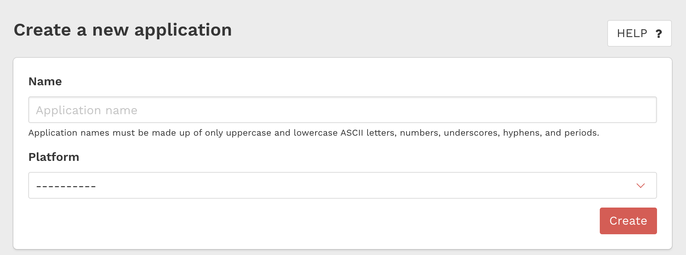

# 10 Darts sample project #

Sample project that integrates the [10Darts library](https://github.com/10darts/android-TendartsSDK). The purpose of this project is double. On the one hand, to create an app that integrates the SDK and allows you to test the different functionalities it offers, and on the other hand, to have the possibility to work on the SDK module directly on the same project.

## Index ##

- [Requirements](#markdown-header-requirements)
- [SDK integration steps](#markdown-header-sdk-integration-steps)

## Requirements ##

* Android 4.4(19) or higher
* Andriod Studio 3.0.1 or higher

### SDK integration steps ###

We have a [setup guide](https://docs.10darts.com/tutorials/android/setup.html) and a [guide for GCM](https://docs.10darts.com/faq/android/ gcm.html).

However there is a section that is not entirely clear, it is necessary to create an app in the dashborad of 10 Darts:

